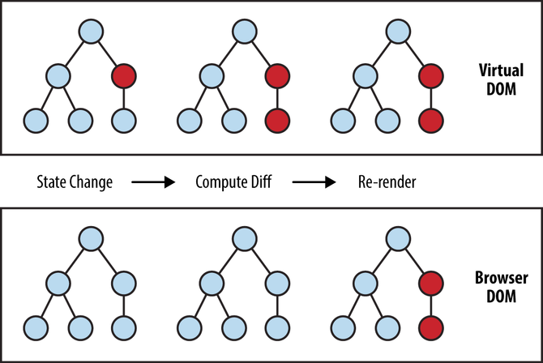
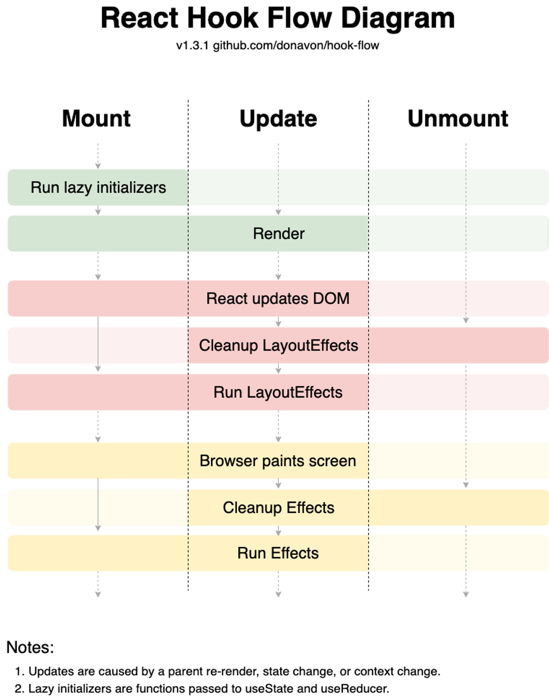

# 04. React 주요 개념

## 01. 가상DOM


[Virtual DOM과 Internals - React](https://ko.legacy.reactjs.org/docs/faq-internals.html)

- **가상 DOM**은 실제 DOM을 흉내 낸 가상의 DOM이다.
- React 같은 라이브러리는 가상 DOM을 사용해서 실제 DOM보다 <span style="color:red"> 빠르게 UI 변경사항</span>을 관리해준다.
- 가상 DOM은 변경이 필요한 부분만 실제 DOM에 반영해줘서, 페이지 전체를 새로 불러오는 것보다 훨씬 효율적이다.
- 개발자 입장에서도 DOM을 직접 다루는 대신 React가 가상 DOM을 이용해 필요한 부분만 자동으로 업데이트해주니 훨씬 편리하게 그리고 높은 생산성으로 서비스를 만들 수 있다.

## 02. JSX

### 01. JSX란?

- JSX는 JavaScript를 확장한 문법으로, React에서 UI 구조를 표현하는 데 사용된다.
- HTML 태그와 유사하게 생겼지만, 실제로는 JavaScript의 확장이기에 절대 혼동해서는 안된다.

```jsx
HTML 태그 <h1>과 JSX <h1>은 완전히 다른 것이다!
```

- JSX는 React 라이브러리의 `createElement` 함수 호출을 보다 직관적으로 표현해주는 문법적 편의를 제공하는 데에 불과하다.

### 02. JSX의 특징

1. HTML과 유사한 문법

- JSX는 HTML 태그와 비슷하게 생겼기 때문에, 웹 개발자에게 친숙하고 읽기 쉽ㄴ다.

2. Javascript와의 결합

- JSX 내에서 JavaScript 표현식을 중괄호 {}로 묶어 사용할 수 있다.
- 이를 통해 데이터 바인딩이나 반복문 처리 등이 가능하다.

```jsx
function App() {
  const name = "Young";

  return <div>Hello~! My name is {name}.</div>;
}
```

3. 컴포넌트 기반

- React 컴포넌트를 JSX를 사용하여 리액트 엘리먼트로 만들 수 있다.
- 이를 통해 UI를 구조화하고 재사용할 수 있다.

### 03. JSX 사용 예시

```jsx
// 컴포넌트 선언
function SomeComponent() {
  return <h1>{3 + 5}</h1>;
}

// 엘리먼트 생성
const someElement = <SomeComponent />;

// 컴포넌트의 재사용
function AnotherComponenet() {
  return (
    <div>
      <SomeComponent />
      <SomeComponent />
    </div>
  );
}
```

### 04. JSX의 장점

- **읽기 쉽고 작성하기 편리** <br>UI 코드가 시각적으로 이해하기 쉬워, 개발 효율성이 높아진다.
- **컴포넌트 구조 명확화**<br> 컴포넌트의 구조를 한눈에 파악하기 쉬워, 프로젝트의 유지보수성이 향상됩니다.

### 05. JSX 사용 시 주의사항

- 브라우저는 JavaScript의 확장인 JSX는 읽지 못하고 JavaScript만 읽을 수 있다.
- 따라서 트랜스파일러(Babel 등)를 사용하여 JSX를 일반 JavaScript로 변환하여 웹 브라우저에 보내주어야 한다.

## 03. React Component vs React Element

### 01. 리액트 컴포넌트 (React Component)

- 리액트 컴포넌트는 UI의 한 부분을 캡슐화한 코드 블록이다.
- - 과거에는 클래스를 사용하여 컴포넌트를 만들었지만 이제는 함수로 만드는 것이 일반적이다.

```jsx
function Greeting() {
  return <div>Hello World</div>;
}
```

### 02. 리액트 엘리먼트 (React Element)

- 리액트 엘리먼트는 컴포넌트의 인스턴스로, 화면에 표시할 내용을 기술한 객체이다.
- JSX 문법을 사용하여 생성할 수 있다.

```jsx
<Greeting />
```

## 04. State

[state:A Component's Memory - React](https://react.dev/learn/state-a-components-memory)

- state는 **React 컴포넌트 내부**의 동적인 데이터를 관리하는 데 사용되는 **데이터**구조이다.
- 일반적으로 시간에 따라 변하는 값이나 사용자의 상호작용 또는 네트워크 응답 등에 의해 변경되는 값을 State로 관리한다.
- **State가 바뀌면 컴포넌트는 리렌더링**을 한다.
- 리렌더링이 된다는 것은 함수가 재실행된다는 뜻이고, 그 결과 화면이 다시 그려지게 된다.
- 함수는 재실행되지만 상태값은 어딘가에 계속 기억이 되고 있다.

```jsx
import React, { useState } from "react";

function Counter() {
  const [count, setCount] = useState(0); // 초기값 0

  const increment = () => {
    setCount(count + 1); // count를 1 증가시키는 함수
  };

  return (
    <div>
      <p>현재 카운트 : {count} </p>
      <button onClick={increment}> 증가 </button>
    </div>
  );
}
```

## Props

- 부모 컴포넌트로부터 자식 컴포넌트에 전달하는 데이터를 Props라고 한다.
- 자식 컴포넌트 입장에서 Props는 읽기 전용으로, 수정해서는 안된다.
- props를 잘 사용하면 컴포넌트의 재사용성과 유연성이 크게 증가한다.
- 부모가 전달해 주는 props 값이 바뀌면 자식 컴포넌트는 리렌더링을 한다.

```jsx
function Greeting(props) {
  return <h1> 안녕하세요, {props.name}님!</h1>;
}

function App() {
  const someName = "철수";

  return (
    <div>
      <Greeting name="지수" />
      <Greeting name={someName} />
    </div>
  );
}
```

## 06. 리렌더링의 조건

- `state`가 변경되면 컴포넌트는 리렌더링된다.
- 부모 컴포넌트로부터 전달 받는 `props`의 값이 변경되면 컴포넌트는 리렌더링된다.
- 부모 컴포넌트가 리렌더링되면 자식 컴포넌트는 리렌더링된다. -> React.memo로 memoization 가능

## 07. React Component의 생애주기




- Mounting = 컴포넌트가 브라우즈에 딱 장착되는 것
- Updating = 마운트된 후에 업데이트 되는 것
- Unmount = 페이지 나감? unmount

---

## 08. 주특기 입문 주차 학습 목표

- 리액트 기초과정을 수강 후, 다음 질문에 답할 수 있어요.
  - [ ] 리액트의 기본 개념과 원리 중 "가상 돔(Virtual DOM)"에 대해 설명해주세요.
        <br> 가상돔은 쉽게말해서 진짜 돔을 흉내낸 것이다.<br>
        DOM과는 다르게 JS안 즉 메모리 안에 존재하는 것으로 진짜 돔을 재조정하기 위해 존재하는 것 <br>
        진짜 돔을 변경하는 과정에서 가상돔은 이전상태와 변경상태 2개가 필요하고 이 둘을 바꾸는 것은 실제 돔 두개를 비교하는 것에 비해 상대적으로 빠르기에 가상끼리 비교 후 다른 점을 찾아내어 물리 DOM에 업데이트를 하게 된다.
  - [ ] 리액트에서 자주 사용되는 자바스크립트 필수 문법 중 "구조분해할당(Destructuring Assignment)"에 대해 설명해주세요.<br>
        객체랑 배열을 뜯어낼 수 있음
  - [ ] Vite를 사용하여 개발 환경을 구축하는 방법에 대해 설명해주세요.<br>
        npm create vite@latest
  - [ ] ‘부모 컴포넌트’와 ‘자식 컴포넌트’ 사이에서 데이터를 전달하는 방식에 대해 설명해주세요.<br>
        props 전달
  - [ ] JSX 문법이 무엇이지, 일반 HTML 문법과는 어떤 차이가 있는지 설명해주세요.<br>
        JS의 확장 문법이고 React.createElement를 쉽게 표현하기 위해 나온 것이 JSX이다.<br>HTML과의 차이점? 완전히 다르고 문법적 차이가 있다.
  - [ ] 리액트에서 ‘Props’와 ‘State’의 역할과 차이점에 대해 설명해주세요.<br>
  - [ ] 불변성(Immutability)의 원칙과 순수 함수의 개념 및 역할에 대해 설명해주세요.
  - [ ] 반복되는 컴포넌트를 처리하고 분리하는 방법에 대해 설명해주세요.<br>
        반복되는 UI를 처리한다는 질문으로 바뀐다면 이를 component로 해결한다.
