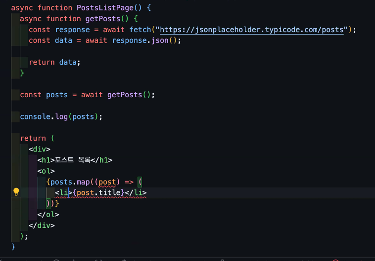
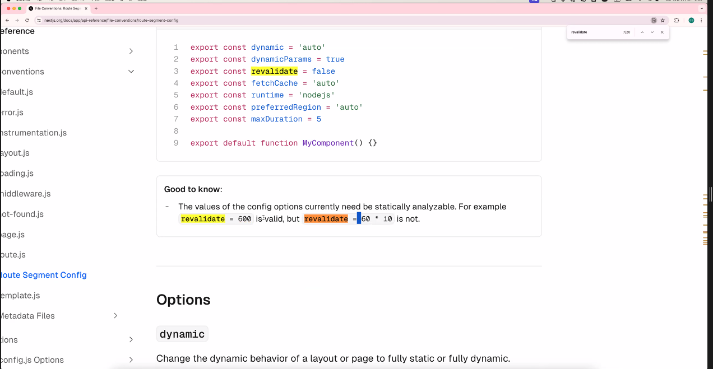

Next.js 에서 딱 하나 기억을 해야 한다면??

1. app 디렉터리 아래에서의; 폴더 구조가 그대로 url 경로가 된다.

예외 사항들을 알아야 한다.

-> app 디렉터리 아래에 폴더로 존재함에도 불구하고 url 경로가 되지 않는 경우

1. (폴더명) => url 경로에서 해당 폴더가 제외되지만, 라우팅 시스템 내부에 여전히 포함된다.
2. \_폴더명 => url 경로에서 해당 폴더가 제외되며, 라우팅 시스템 내부에서 완전히 제외된다.

-> 대체 뭐가 라우팅 시스템인데?

app/hello/page.tsx
-> /hello

app/(hello)/page.tsx
-> / => page.tsx가 나옴

app/\_hello/page.tsx
-> 404 err => page.tsx가 무시됨

그럼 언제 쓰냐?
app/(providers)/posts/page.tsx -> layout적용은 하고싶은데 url에 널 띄우고 싶진 않아 사라져1

\_는 언제씀? => posts 폴더 내부에Header 컴포넌트와 Aside 컴포넌트를 같이 넣고 싶어!! => posts/\_components/컴포넌트들

동적 라우팅 -> 폴더명에 [] 치기

useEffect, useState와 같은 훅들?울 쓸땐 1번째 줄에 'use client'를 써줘야댐
next.js ssr을 위해 만들어진 프레임워크기에 서버에서 그리는 것을 우선으로 하기에 'use client'를 적어줘야 브라우저 관련 작업을 할 수 있다.
!! Next.js가 딱 보고 서버에서 할 수 있을정도면 서버에서 작업해서 보냄 but useState처럼 브라우저 캐시에 담기거나 useEffect와 같은 것들을 쓰면 그 것들이 사용되는 부분을 제외하고 서버에서 그려줌
그럼 언제 꼭 필요할까? 모든 작업에 'use client'를 적어버림년 언제 써야하는지를 모르는 것이니

1. 컴포넌트 내에서 hook을 사용할 때. hook은 대부분 브라우저 환경에서만 작동하기 때문.
2. window, document 등 브라우저 환경에서만 존재하는 변수에 접근할 때

위는 CSR이고 SSR은 어떻게 해?
특이한 점이 있음 컴포넌트 앞에 async를 붙일 수 있음 =>

SSG

Static Site Generation

정적 사이트 생성

정적이다? 절대 바뀌지 않는다.

Next.js 에선 build과정이 있음 => build를 해놓으면 정적으로 만들어져서 실행됨(prerendered as static)

네이버 뉴스를 긁어오는 서비스를 만들었는데 그래도 10초에 한번은 가져와야하지 않을까?
Next.js에서 이를 지원하는데 page.tsx에서
export const revalidate = 5;
를 해준다면 요청이 있을 때 그 요청이 5초를 지났다면? 그 때 다시 가져와서 그려준다.

export const dynamic = "force-dynamic"'
=> 요청마다 서버에서 다시 그려줌

즉, 항상 잘 만들어진 것을 사용할 때는 내가 뭘 할까? -> 찾아보면 있음

