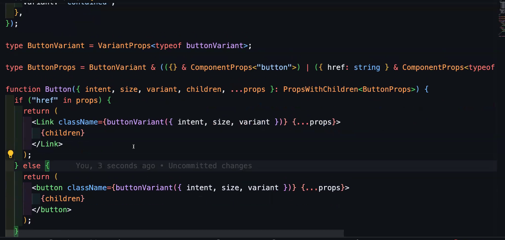
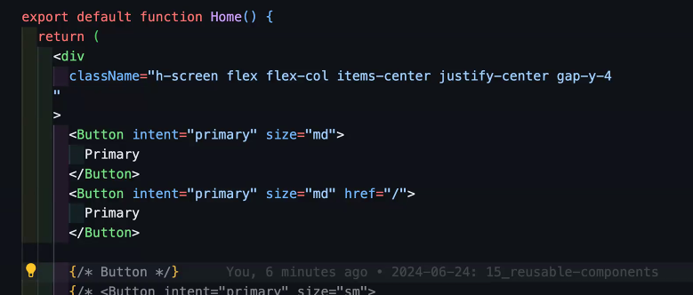

재사용 가능한 컴포넌트를 만드는 순서?

1. 인터페이스 설계 => 쓰는 ㅅ ㅏ람이 어떻게 쓸지를 생각해보자

cva는 인자를 두개받는다.

1. 조합과 무관한 클레스들을 첫번째 인자로 넣어준다.
2. 조합을 넣어준다.
   //chipVariants는 함수

```jsx
const chipVariants = cva(["text-sm", "border", "rounded-full", "px-2.5", "py-0.5", "hover:opacity-50", "transition-opacity"], {
  variants: {
    intent: {
      primary: "bg-blue-500 border-blue-500 text-white",
      secondary: "bg-gray-500 border-gray-500 text-white",
      danger: "bg-red-500 border-red-500 text-white",
      warning: "bg-yellow-500 border-yellow-500 text-white",
      info: "bg-violet-500 border-violet-500 text-white",
      default: "bg-white-500 border-black-500 text-black",
    },
  },
  defaultVariants: {
    intent: "default",
  },
});

function Chip({ label, intent }: ChipProps) {
  // 난 나만의 칩을 위해 추가적 클래스네임을 줄거야!
  //props로 className을 전달받으면? chipVariants({className, intent})
  return <div className={chipVariants({ intent })}>{label}</div>;
}

export default function Home() {
  return (
    <div className="h-screen flex flex-col items-center justify-center place-items-center">
      <Chip intent="Primary" label="primary" />
      <Chip intent="Secondary" label="secondary" />
      <Chip intent="Danger" label="danger" />
      <Chip intent="Warning" label="warning" />
      <Chip intent="Info" label="info" />
      <Chip intent="default" label="default" />
    </div>
  );
}
```





cva + clsx + tailwind merge

Input 컴포넌트가 size를 받는다?
이 size가 label과 input에 영향을 준다 해볼게
그럼 labelVariant, inputVariant 두개를 만들게 되잖아? 이를 className에 넣어줄텐데
경우에 따라 하나에 대해서도 Variant를 여러개를 만들어줄 때가 있다.
ex) inputColorVariant, inputSizeVariant

그럴 경우엔 이 두가지를 합쳐줘야되잖아? 아래처럼 cx(clsx)가 내장되어있는데 이 때 같이 쓴다.
input className ={cx(inputColorVariant({color}), inputVariant({size}))}

tailwindMerge는 직접 확인 해볼것.
